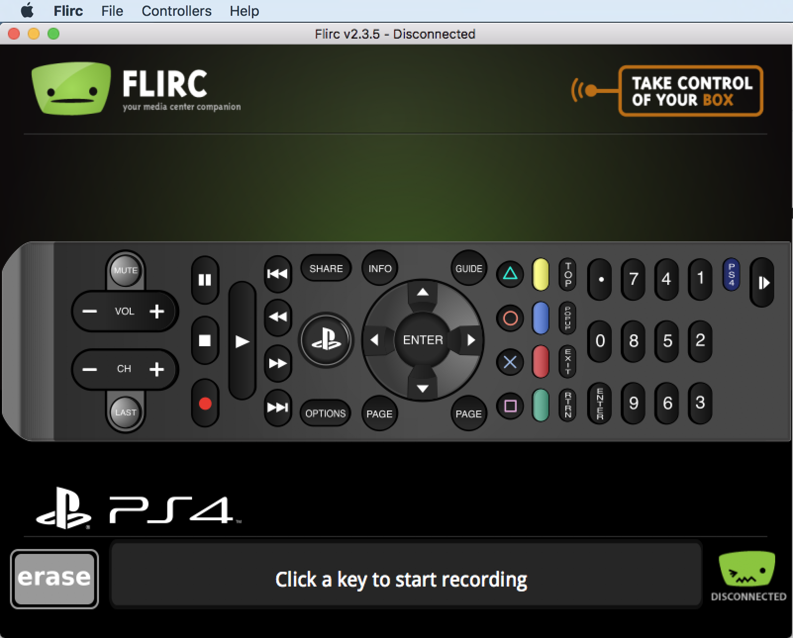

Various popular devices are described in this section. However, should a device not be listed here, it does not mean this device is not supported. Start a [forum discussion](https://forum.flirc.tv/index.php?/forum/104-flirc-usb/) to kick off a thread on support for a new device. This is the best way to get the device added into the GUI.

## NVIDIA Shield

To setup an NVIDIA Shield with Flirc, use the Flirc GUI's NVIDIA Shield Controller as seen below. These are the basic controls for media center operations and support was provided directly by NVIDIA for compatibility.

### Suspending Shield

To suspend the shield or put it in a sleep state, use the Media Keys controller and record the Wake/Suspend key as shown below.

### NVIDIA Settings

After pairing, if flirc doesn't work, then ADB Debugging needs to be turned off and or USB HD storage, the shield could be disabling the USB port for normal operation.

## Apple TV Gen4

There is a USB C port on appleTV. Flirc is not currently supported at this time, however, this will change shortly.

## FireTV

FireTV support is built in to flirc. Please see the FireTV - Harmony guide if using a harmony remote.

Otherwise, please go te the FireTV controller. There are only 11 buttons, hit the Go button, and you will be walked through the pairing process.

### FireTV Settings

After pairing, if flirc doesn't work, then ADB Debugging needs to be turned off on your FireTV. First head to

`Settings->System->Developer Options.`

Then make sure ADB Debugging is ***OFF***

### FireTV Stick

The FireTV Stick is now supported with the new [FireTV Edition Flirc](https://flirc.tv/products/flirc-fire-tv-edition?variant=43085036257512). 

## Playstation 3/4

The PS3/PS4 both share the same controller, which is named PS4. This controller should work for both the Playstation 3 and Playstation 4 with a few caveats. Most of the buttons will work, however, some of the controller specific buttons do not work.

After pairing your remote, simply remove flirc from your PC, and put it in your PS3/PS4. It should work with your previously paired remote without any additional settings.

Because Flirc emulates a keyboard, some applications wont work. Some applications only work with a PS3/PS4 approved controller.

We are working diligently to circumvent this, and a solution is in active development. For more information, to follow development, and to try out beta images, subscribe to the forums and follow the discussion [here](https://forum.flirc.tv/index.php?/forum/104-flirc-usb/).

## Windows Media Center

Windows Media Center, although no longer supported by Microsoft, still has a large user base, and is supported by flirc. Fire up the flirc GUI, and head to the Windows Media controller.

> NOTE - As of June 3rd, 2017, WMCE is fully supported and the previous bug which prevented certain keys from working has been fixed. Please update to firmware version v4.0.24 and above.

## Raspberry Pi

All raspberry pi models are supported. However, the pairing software is currently not currently compiled to run on the raspberry pi.

NOTE - [Shameless plug](https://flirc.tv/collections/case).

The pairing software will absolutely be supported on the raspberry pi again. However, the need for this is not high. Pairing is recommended on another machine anyways, and once finished, you can take your flirc, plug it in the raspberry pi, and it should work with your previously paired remote without the need for any additional software.

## XBOX 360

XBOX 360 is supported through the XBOX 360 controller in the GUI.

Once paired, take your flirc out of your PC, and put it in the XBOX 360's USB port. Flirc should work with your XBOX and your previously paired remote without any additional software or settings.

