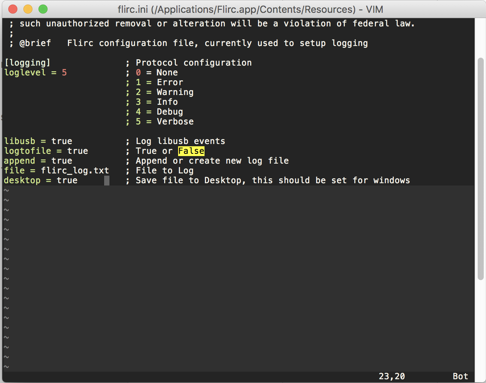

# MacOS

To enable logging on the Mac, right click the Flirc.app icon in the Applications folder and select, Show Package Contents.

Edit the flirc.ini file in: Contents/Resources/

Make the following changes:

- Change loglevel = 0 to loglevel 5
- Change all the false words to true

The file should look like the following:

