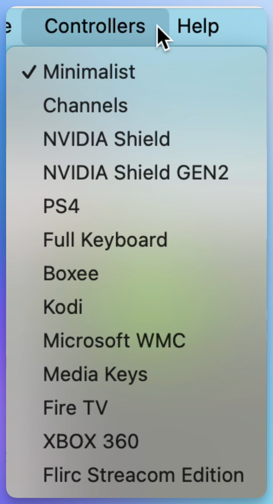

# Graphical User interface

The graphical user interface (GUI), is the heart of the flirc application. The application allows you to pair your flirc with your remote. Regular updates are provided, and the application works on Windows, Mac, and Linux.

## Supported Controllers

The following are supported controllers. More are always being added. To request another, please send an email to the flirc team.

- Minimal- The basic most fundamental controls needed for any media center
- Channels
- [NVIDIA Shield](https://www.nvidia.com/en-us/shield/) - One of the most popular android set top boxes, powered by NVIDIA Tegra
- [NVIDIA Shield GEN2](https://www.nvidia.com/en-us/shield/) - One of the most popular android set top boxes, powered by NVIDIA Tegra
- PS3 / PS4- Playstation 3 and Playstation 4. This controller should work for both devices. Caveats listed here.
- Full Keyboard - Pair any keyboard key or combination with Flirc
- Boxee - A platform extremely popular prior to 2014 that was purchased by Samsung
- [Kodi](http://kodi.tv/) - Also known as XBMC, the most popular open source media center software in the world
- Windows Media - Keyboard shortcuts for windows media center
- Media Keys - Computer media keys as that control various things without needing windows focus
- FireTV - Amazon's set top box (If using the FireTV Stick, our [FireTV Edition Flirc USB](https://flirc.tv/products/flirc-fire-tv-edition?variant=43085036257512) is recommended!)
- XBOX 360 - Microsofts latest and greatest game console 
- Flirc Streacom Edition
> **note:** Later Xbox media remotes are not supported
## How the FLIRC GUI Works

[Remember](../Introduction/index.md#how-flirc-works) flirc shows up to the device it's connected to as a keyboard, or HID device. The user interface presents pictures of different 'controllers'. These controllers hide the details. For example, to control Kodi, keyboard combinations are needed. Our Kodi controller will present an on screen display of Kodi controls. The Play key as an example shown below, is just a keyboard key 'P'. When pairing a remote control button with the 'play' button, on successive presses of this remote button will send the letter 'p' to the computer, in turn, playing the media on Kodi.

## Missing Keys on a Controller

If a controller is missing a key, not to worry. Since these are all keyboard keys, you can use the keyboard controller to pair any key, or combination of keys.

