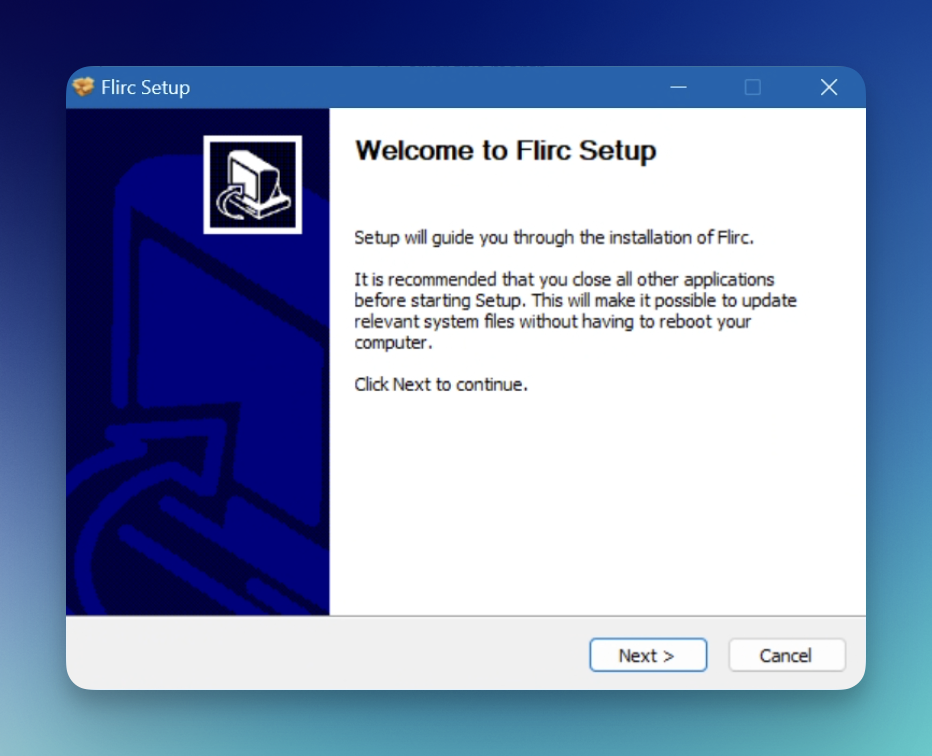

# Windows Installation Guide

:one: Double click the Flirc.exe, which will run the automated installer.

:two: Follow the installer steps, the installer will install the flirc drivers which enable us to to program Flirc generation 1, this may result in a security pop-up. Flirc Gen2 will work without any drivers, the installer will install drivers for only the plastic first generation of flirc.

:three: Click "install this driver software anyway" and continue. If the driver fails to install for any reason, and Flirc Gen2 is being used, the pairing software will still work, as the driver is no longer needed.

When the installer is complete plug in the Flirc device and Windows will complete the install of the driver.

:four: After the driver has been installed you may need to restart the computer (you may be prompted to do this). Installation is complete.

## Software Updates

Windows software updates are unfortunately not automatic. We recommend subscribing to our blog or twitter where we announce regular updates. Updates need to be downloaded and installed.
