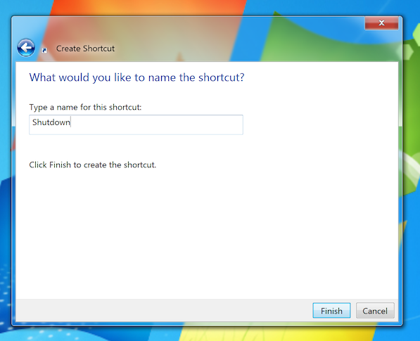
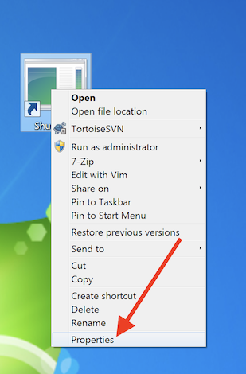
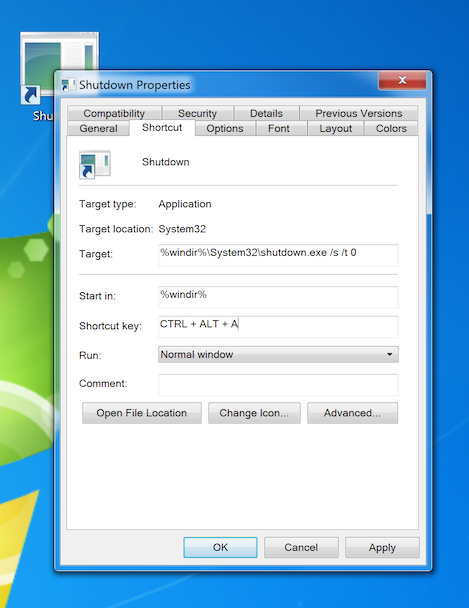

# Windows 

## Shutdown the Computer with Remote Button

Right click anywhere on the desktop, and click, 'shortcut'

Enter the text: `%windir%\System32\shutdown.exe /s /t 0`

Now give the name to the new shortcut, we'll use 'shutdown' and click Finish.

Right Click on the Script, and click Properties.

Now assign a keyboard shortcut to our new script.

That's it, now open up the Flirc GUI and pair that keyboard combo to any remote control button. You can also use this action as a long press.
