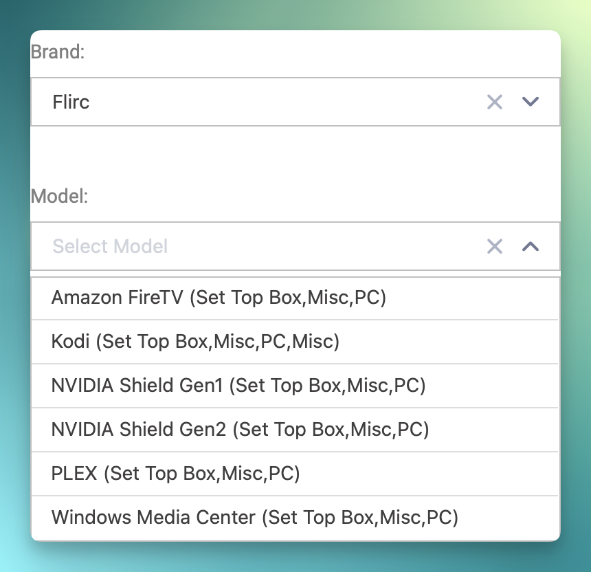
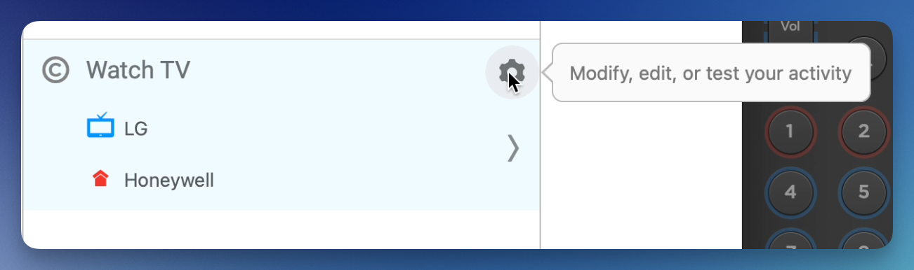

# Skip Remote Setup

# Logitech Harmony Remote Setup

Certain Skip profiles are built in to flirc. This means that our pairing software isn't needed if Flirc and Skip are being used on one of the devices in the Supported Devices list below. If a device is not in the list below, it is still supported, and instructions can be found below in Adding a Logitech Device Manually.

## Supported Devices

The following are currently supported profiles in the SkipApp.

- Amazon FireTV
- Kodi (XBMC)
- FireTV
- NVIDIA Shield Gen1
- NVIDIA Shield Gen2
- PLEX
- Windows Media Center

## Skip - Flirc USB Setup

Launch the Skip App. 

Hit the gear next to the activity you want to add your Flirc USB to. Open the Wizard.

Click on the button ***"Add device"***. Select Set Top Box, PC, or Misc and hit **Continue**. Type **Flirc** into the Brand, then select from the list of supported devices.

Follow the rest of the wizard as you would normally.

That's it. You're done! Plug flirc into any device that's going to run your selected application or selected device, and your remote control will work with flirc. Flirc comes pre-configured for the Skip 1s, and will work without any additional software requirements.

